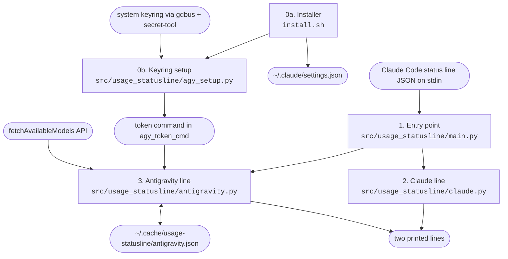
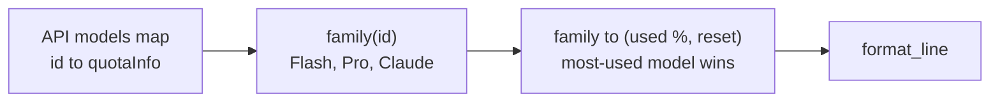

# Architecture

## Overview
Claude Code runs a status line command after each update and every 60 seconds. It sends session
JSON to the command on stdin. `usage_statusline` prints two lines. The first shows Claude Pro
5-hour and 7-day usage from that JSON. The second shows Antigravity (`agy`) quota, fetched from
Google's Code Assist API and cached. `install.sh` wires the command into
`~/.claude/settings.json`.

## Diagram

| Stage | Module | Reads | Writes |
|---|---|---|---|
| 0a. Installer | `install.sh` | `~/.claude/settings.json` | `statusLine` key, one-time `.bak-usage-statusline` backup |
| 0b. Keyring setup | `src/usage_statusline/agy_setup.py` | keyring labels and attributes, one secret lookup | `~/.config/usage-statusline/agy_token_cmd` |
| 1. Entry point | `src/usage_statusline/main.py` | stdin JSON | stdout |
| 2. Claude line | `src/usage_statusline/claude.py` | `rate_limits` in the JSON | one line |
| 3. Antigravity line | `src/usage_statusline/antigravity.py` | token command, API, cache | cache file, one line |

Core structure (the Antigravity quota after parsing):

## Modules
| Module | Responsibility | Status |
|---|---|---|
| `src/usage_statusline/main.py` | Reads stdin and prints both lines | built (2 tests) |
| `src/usage_statusline/claude.py` | Formats the Claude 5-hour and 7-day windows | built (3 tests) |
| `src/usage_statusline/antigravity.py` | Gets and decodes the token, calls the API, parses the response, and caches the line | built (10 tests), live API response not verified |
| `src/usage_statusline/agy_setup.py` | Finds the agy keyring entry and saves the token command | built (8 tests, fake keyring), not yet run on a real keyring |
| `install.sh` | Installs or uninstalls the settings entry, then runs `agy_setup` | built (4 tests) |

### Public API of what is built
- `claude.claude_line(data: dict) -> str`: never raises on missing fields.
- `claude.fmt_window(label: str, used_pct: float, resets_at: datetime) -> str`: `"week 41% · resets Thu 09:00"` in local time.
- `antigravity.parse_quota(resp: dict) -> dict[str, tuple[float, datetime]]`: maps each family to used percent and reset time. A missing `remainingFraction` counts as 0 remaining (100% used).
- `antigravity.format_line(quota) -> str`
- `antigravity.fetch_line() -> str`: makes a network call and never raises. Errors become `n/a (...)` text.
- `antigravity.antigravity_line(cache: Path = CACHE, now: float | None = None) -> str`: fetches at most once per `CACHE_TTL` (60 s), and caches errors too.
- `antigravity.extract_token(raw: str) -> str`: accepts a plain token, oauth2 JSON (`access_token`), or `go-keyring-base64:`. Raises `ValueError` on bad JSON or base64.
- `agy_setup.main(argv, run=sh, which=shutil.which) -> int`: returns 0 when it saves the config, 1 otherwise. `run` takes an argv list and returns stdout, which tests replace with a fake keyring.
- `install.sh [--uninstall] [--no-agy] [--agy-entry N]`: the `CLAUDE_SETTINGS` env var overrides the settings path. Tests always pass `--no-agy`.

## Key decisions
- 2026-09-27: `install.sh` finds the agy keyring entry itself (`agy_setup.py`), at your request. It saves `secret-tool lookup <attrs>` rather than the token, so no secret lands on disk, and the status line decodes the raw secret with `extract_token`. It skips "Safe Storage" entries, which hold the IDE's Chromium key. Claude Code's auto mode blocks this work, so it was built in default permission mode and tested only against a fake keyring.
- 2026-09-27: The Antigravity token comes from a command stored in `~/.config/usage-statusline/agy_token_cmd` or `USAGE_STATUSLINE_AGY_TOKEN_CMD`, not a stored token, because the token expires about hourly and agy refreshes it in the keyring.
- 2026-09-27: Python stdlib, not bash and `jq`, so the parsing and caching can be tested with pytest. Startup cost is about 30 ms per run.
- 2026-09-27: `refreshInterval: 60` keeps the Antigravity line current while Claude Code is idle. The cache TTL matches it.
- 2026-09-27: Errors are cached for the full TTL, so an expired token never makes the status line call the API on every update.

## How data flows
1. Claude Code runs `PYTHONPATH=<repo>/usage-statusline/src python3 -m usage_statusline` with JSON on stdin.
2. `main` parses stdin and treats invalid JSON as `{}`.
3. `claude_line` formats `rate_limits.five_hour` and `rate_limits.seven_day`, skipping any window that is absent.
4. `antigravity_line` returns the cached line if it is less than 60 seconds old. Otherwise, it runs the token command, POSTs `{}` to `fetchAvailableModels`, parses the response, and writes the cache.
