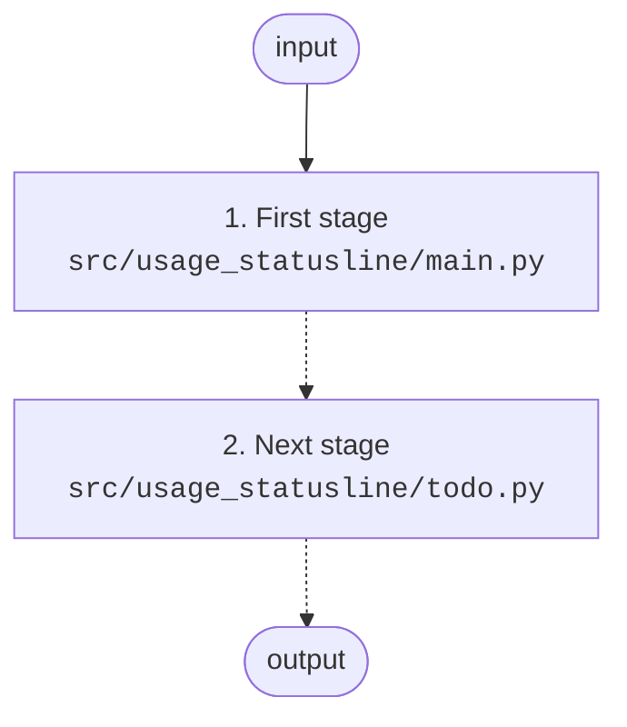
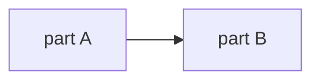

# Architecture

<!-- Keep this file short and current. It exists so a model can understand
the project without reading every source file. Update it whenever a module
is added/removed or module responsibilities change. -->

## Overview
A Claude Code status line script that reads Claude Pro 5-hour and weekly usage from the status line JSON, and Antigravity quota from its own source, and prints one line per provider with reset times. An install script wires it into `~/.claude/settings.json`.

## Diagram
<!-- Required (see "Stage discipline" in ~/projects/CLAUDE.md). Keep it readable:
short labels, dashed arrows for stages not built yet, module path in <code>. -->

| Stage | Module | Reads | Writes |
|---|---|---|---|
| 1. First stage | `src/usage_statusline/main.py` | input | output |

Core structure (the project's central object — model, schema, state machine):

## Modules
<!-- Keep the Status column honest — it is how a new session knows where to start.
Use: built (N tests) / not started / placeholder. Never claim a status you did
not verify by running the tests in this session. -->
| Module | Responsibility | Status |
|---|---|---|
| `src/usage_statusline/main.py` | Entry point | placeholder |

### Public API of what is built
<!-- Signatures only, so the next stage can call these without reading the source.
Note anything surprising: what commits, what is lazy, what raises. -->

## Key decisions
<!-- One line each: what was decided and why. Newest first. -->
- YYYY-MM-DD: Example — chose sqlite over JSON files because we need concurrent reads.

## How data flows
Describe the main path a request/input takes through the modules, in numbered steps.
