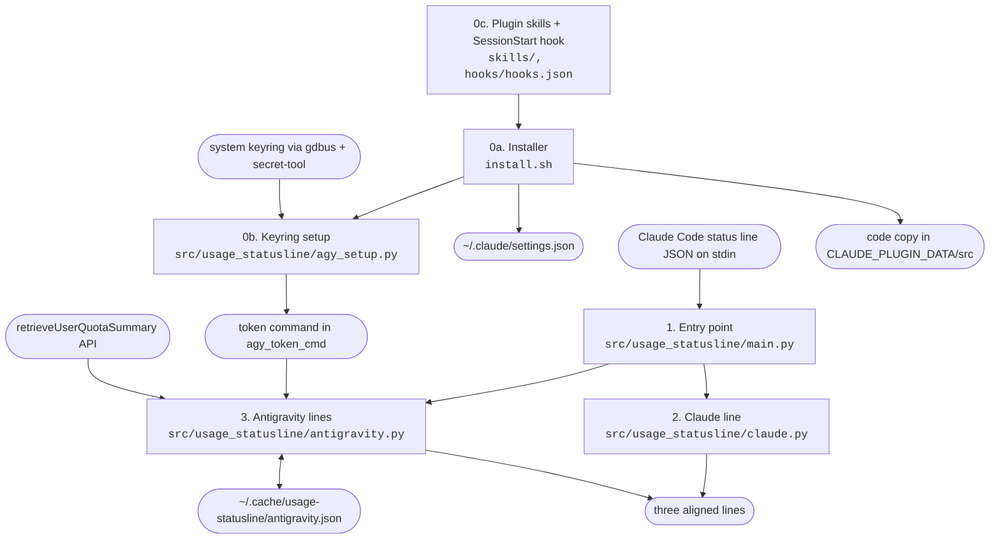
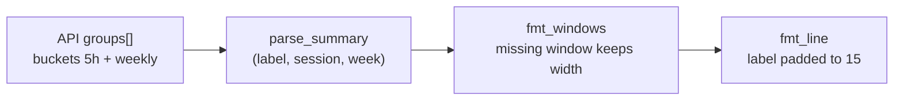

# Architecture

## Overview
Claude Code runs a status line command after each update and every 60 seconds. It sends session
JSON to the command on stdin. `usage_statusline` prints three aligned lines. The first shows
Claude Pro 5-hour and 7-day usage from that JSON. The others show one Antigravity (`agy`) quota
group each (Gemini, and Claude/GPT) with its 5-hour and weekly usage, fetched from Google's Code
Assist API and cached. `install.sh` wires the command into
`~/.claude/settings.json`. The same repository is published as the Claude Code plugin `quotaline`, and it's also its
own marketplace (`quotaline@mlemes`), whose skills run `install.sh` for you. It's built to pair
with the `antigravity-for-claude-code` plugin, which hands work off from Claude Code to `agy`, so
you can watch and balance both quotas.

## Diagram

| Stage | Module | Reads | Writes |
|---|---|---|---|
| 0a. Installer | `install.sh` | `~/.claude/settings.json` | `statusLine` key, one-time `.bak-usage-statusline` backup, `DIR/src` with `--dest` |
| 0c. Plugin | `skills/install`, `skills/uninstall`, `hooks/hooks.json` | `${CLAUDE_PLUGIN_ROOT}` | runs `install.sh --dest ${CLAUDE_PLUGIN_DATA}` (`--sync` at session start) |
| 0b. Keyring setup | `src/usage_statusline/agy_setup.py` | keyring labels and attributes, one secret lookup | `~/.config/usage-statusline/agy_token_cmd` |
| 1. Entry point | `src/usage_statusline/main.py` | stdin JSON | stdout |
| 2. Claude line | `src/usage_statusline/claude.py` | `rate_limits` in the JSON | one line, plus the shared column layout |
| 3. Antigravity lines | `src/usage_statusline/antigravity.py` | token command, API, cache | cache file, one line per quota group |

Core structure (one quota group after parsing, rendered with the shared layout):

## Modules
| Module | Responsibility | Status |
|---|---|---|
| `src/usage_statusline/main.py` | Reads stdin and prints the Claude line, then the Antigravity lines | built (2 tests in `test_smoke.py`) |
| `src/usage_statusline/claude.py` | Formats the Claude 5-hour and 7-day windows, and owns the aligned layout shared by all lines | built (4 tests) |
| `src/usage_statusline/antigravity.py` | Gets and decodes the token, calls the API, parses quota groups, and caches the lines | built (10 tests), verified live on 2026-09-27 |
| `src/usage_statusline/agy_setup.py` | Finds the agy keyring entry and saves the token command | built (9 tests), verified on the real keyring on 2026-09-27 |
| `src/usage_statusline/settings_entry.py` | Adds or removes the `statusLine` key in `settings.json`, run by `install.sh` | built (2 tests) |
| `install.sh` | Installs or uninstalls the settings entry through `settings_entry`, then runs `agy_setup`. With `--dest`, runs from a copy | built (6 tests) |
| `.claude-plugin/`, `skills/`, `hooks/` | Plugin manifest, `mlemes` marketplace, install and uninstall skills, and the sync hook | built (2 tests in `test_plugin.py`), `claude plugin validate .` passes |

### Public API of what is built
- `claude.claude_line(data: dict) -> str`: never raises on missing fields.
- `claude.LABEL_WIDTH = 15`: every line pads its label to this width.
- `claude.fmt_window(label: str, used_pct: float, resets_at: datetime) -> str`: `"week  41% · resets Thu 09:00"` in local time, percent right-aligned to 3 digits.
- `claude.fmt_line(label: str, body: str) -> str`: pads the label to `LABEL_WIDTH`.
- `claude.fmt_windows(session, week) -> str`: each argument is `(used_pct, datetime) | None`. Joins with ` | `. A missing window prints `--` padded to full width.
- `antigravity.parse_summary(resp: dict) -> list[tuple[str, Window | None, Window | None]]`: one `(label, 5h, weekly)` per group in API order, where `Window = (used_pct, reset datetime)`. A missing `remainingFraction` counts as 100% used. Buckets without `resetTime` are skipped. Labels come from `GROUP_LABELS` by `bucketId` prefix, else `displayName`.
- `antigravity.format_lines(groups) -> str`: one line per group joined by `\n`, or `Antigravity    no quota data`.
- `antigravity.fetch_line() -> str`: makes a network call and never raises. Errors become a single `Antigravity    n/a (...)` line.
- `antigravity.antigravity_line(cache: Path = CACHE, now: float | None = None) -> str`: returns the possibly multi-line text, fetches at most once per `CACHE_TTL` (60 s), and caches errors too.
- `antigravity.extract_token(raw: str) -> str`: accepts a plain token, oauth2 JSON (`access_token`), agy's wrapper (`{"token": {oauth2}}`), or `go-keyring-base64:`. Raises `ValueError` on bad JSON or base64.
- `agy_setup.main(argv, run=sh, which=shutil.which) -> int`: returns 0 when it saves the config, 1 otherwise. `run` takes an argv list and returns stdout, which tests replace with a fake keyring.
- `settings_entry.update(settings, cmd, mode) -> str | None`: changes the dict in place; `mode` is `install` or `--uninstall`; returns `None` when uninstall finds another command. CLI: `python3 -m usage_statusline.settings_entry PATH CMD MODE`.
- `install.sh [--uninstall] [--no-agy] [--agy-entry N] [--dest DIR [--sync]]`: the `CLAUDE_SETTINGS` env var overrides the settings path. Tests always pass `--no-agy`. `--dest DIR` swaps a fresh copy into `DIR/src` and points `statusLine` there. `--uninstall --dest DIR` also deletes `DIR/src`. `--sync` refreshes `DIR/src` only if it exists and never touches settings.
- Plugin: `/quotaline:install [--no-agy] [--agy-entry N]` and `/quotaline:uninstall`, both `disable-model-invocation: true`.

## Key decisions
- 2026-09-27: `PRIVACY.md` states that the author receives no data, lists what's read, stored, and sent (Google for the quota, Anthropic through the Claude Code session), and says how to delete it, at your request, for the plugin directory. Contact is GitHub issues, not an email address.
- 2026-09-27: The README, manifest, and marketplace entry say quotaline is built to pair with `antigravity-for-claude-code` (github.com/yuting0624/antigravity-for-claude-code), at your request. That plugin delegates Claude Code work to `agy`, and quotaline shows both quotas so you can balance the two. quotaline doesn't depend on it or call it.
- 2026-09-27: The token command runs without a shell (`shlex.split`, `shell=False`), in both `antigravity.py` and `agy_setup.py`. The directory flagged `shell=True` next to a URL fetch as download-and-execute, and the saved `secret-tool lookup` needs no shell. Custom commands can't use pipes; wrap them in a script.
- 2026-09-27: The repository has no `CLAUDE.md`, `.claude/`, `docs/TASKS.md`, or template folders (`data/`, `pipelines/`, `explore/`), unlike the workspace template. Plugins don't load a root `CLAUDE.md`, the plugin directory scanned the template's `.claude/skills/` as plugin surfaces, and none of these files help someone who installs the plugin.
- 2026-09-27: The `statusLine` edit moved from a Python here-document in `install.sh` to the module `settings_entry.py`, so a reviewer reads, and the tests cover, a plain file. `install.sh` still runs Python, so the directory still sends it to a reviewer, and the README's "Notes for reviewers" explains each flagged point.
- 2026-09-27: Published as a plugin from its own repository, which is also the `mlemes` marketplace (`source: "./"`). A plugin can't set `statusLine` (plugin `settings.json` honors only `agent` and `subagentStatusLine`), so the install skill runs `install.sh`.
- 2026-09-27: The plugin runs the status line from a copy in `${CLAUDE_PLUGIN_DATA}/src`, because `${CLAUDE_PLUGIN_ROOT}` changes on every plugin update. A SessionStart hook refreshes the copy. The copy is swapped in whole so a running status line never sees a partial package.
- 2026-09-27: Renamed the plugin and repository to `quotaline`, because the directory holds generic names and names close to existing ones (`claude-usage-statusline`) for review, and brand names (`claude`, `antigravity`) too. The Python package, the config and cache paths, and the monorepo directory keep `usage-statusline`, so existing installs keep working.
- 2026-09-27: `plugin.json` sets `version` (same as `pyproject.toml`, 0.1.1 as of 2026-09-27), as the plugin directory asks. Users get an update only when `version` rises, so raise it on every release.
- 2026-09-27: The README lists everything the plugin runs, reads, writes, and sends, for the directory's security scan. Reading `agy`'s token from the keyring will likely be held for a reviewer ("uses a credential from the user's machine"). `userConfig` can't replace it, because the token expires about hourly.
- 2026-09-27: MIT license.
- 2026-09-27: Antigravity shows one line per quota group from `retrieveUserQuotaSummary`, at your request. This endpoint has both the 5-hour and weekly windows, and it shows that Gemini Flash and Pro share one quota, so per-model lines from `fetchAvailableModels` were misleading.
- 2026-09-27: All lines share one layout in `claude.py` (label width 15, 3-digit percent, fixed-width missing windows), at your request, so the `session`, `|`, and `week` columns align.
- 2026-09-27: The API request sends `User-Agent: antigravity`, because Google returns 403 to the default `Python-urllib` agent.
- 2026-09-27: `install.sh` finds the agy keyring entry itself (`agy_setup.py`), at your request. It saves `secret-tool lookup <attrs>` rather than the token, so no secret lands on disk, and the status line decodes the raw secret with `extract_token`. It skips "Safe Storage" entries, which hold the IDE's Chromium key. Claude Code's auto mode blocks this work, so it was built in default permission mode and tested only against a fake keyring.
- 2026-09-27: The Antigravity token comes from a command stored in `~/.config/usage-statusline/agy_token_cmd` or `USAGE_STATUSLINE_AGY_TOKEN_CMD`, not a stored token, because the token expires about hourly and agy refreshes it in the keyring.
- 2026-09-27: Python stdlib, not bash and `jq`, so the parsing and caching can be tested with pytest. Startup cost is about 30 ms per run.
- 2026-09-27: `refreshInterval: 60` keeps the Antigravity line current while Claude Code is idle. The cache TTL matches it.
- 2026-09-27: Errors are cached for the full TTL, so an expired token never makes the status line call the API on every update.

## How data flows
1. Claude Code runs `PYTHONPATH=<repo>/usage-statusline/src python3 -m usage_statusline` with JSON on stdin.
2. `main` parses stdin and treats invalid JSON as `{}`.
3. `claude_line` formats `rate_limits.five_hour` and `rate_limits.seven_day`, skipping any window that is absent.
4. `antigravity_line` returns the cached line if it is less than 60 seconds old. Otherwise, it runs the token command, POSTs `{}` to `retrieveUserQuotaSummary`, formats one line per quota group, and writes the cache.
